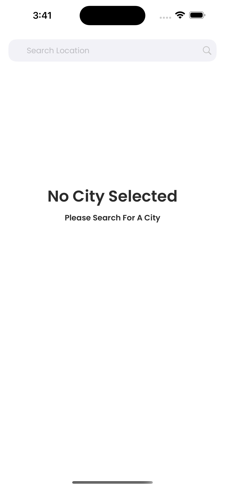
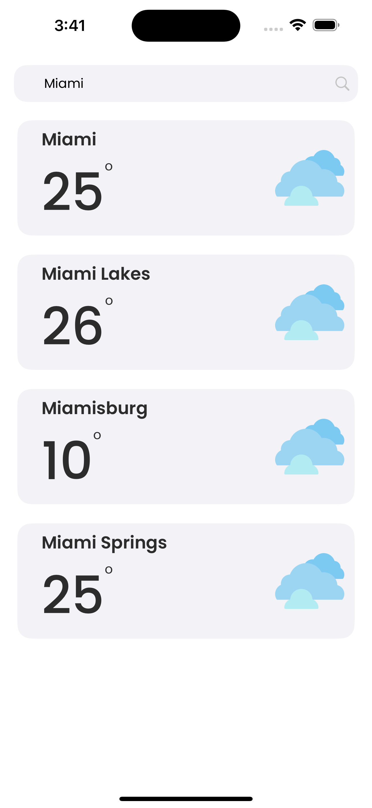
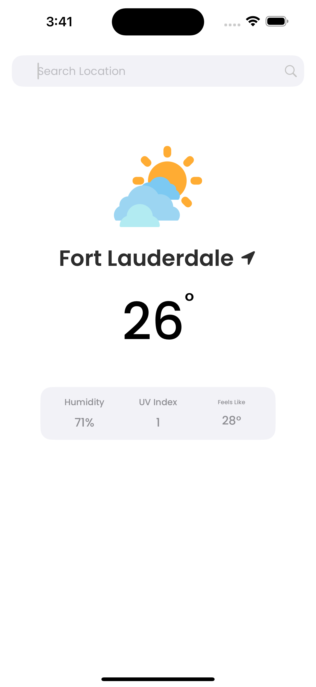

# Weather Tracker

A sleek and modern weather application built with SwiftUI that allows users to search for cities and view their current weather conditions.

## Features

- 🔍 City search with real-time results
- 🌡️ Current temperature display
- 💨 Weather conditions with custom icons
- 💾 Persistent storage of last selected city
- 📱 Clean, modern UI with custom fonts (Poppins)
- 🌤️ Weather details including:
  - Humidity
  - UV Index
  - Feels Like temperature

## Screenshots

| Initial Screen | Search Results | Weather Display |
|:---:|:---:|:---:|
|  |  |  |

## Technologies Used

- SwiftUI
- WeatherAPI.com for weather data
- Async/Await for API calls
- UserDefaults for persistence
- Custom fonts integration
- MVVM Architecture

## Requirements

- iOS 17.0+
- Xcode 15.0+
- WeatherAPI.com API key

## Installation

1. Clone the repository
